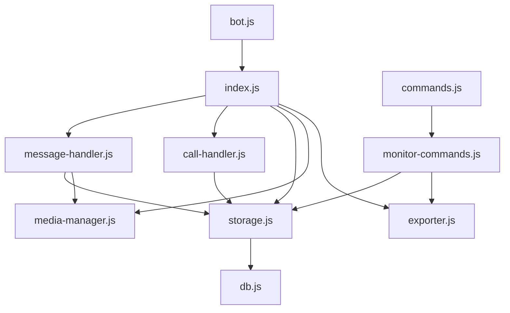
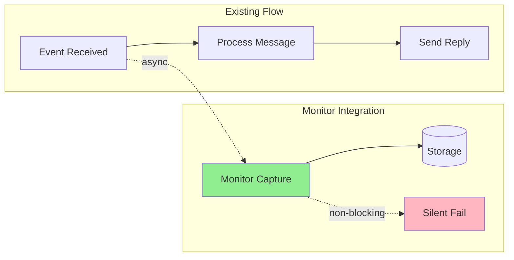

# Message Monitoring System Architecture

## Overview

A comprehensive message and call monitoring system for the Datrix WhatsApp Bot that captures, logs, and manages all message types, media, and call events using a JSON-based storage pattern (LowDB) consistent with the existing codebase.

---

## 1. Module Structure

### 1.1 File Organization

```
src/
├── bot.js                    # Existing - Event hooks added
├── db.js                     # Existing - Schema extended
├── monitor/
│   ├── index.js              # Main monitoring module entry
│   ├── message-handler.js    # Message capture and processing
│   ├── call-handler.js       # Call event handling
│   ├── storage.js            # Database operations for monitor data
│   ├── media-manager.js      # Media download and storage
│   └── exporter.js           # Data export functionality
└── commands/
    └── monitor-commands.js   # Admin commands for monitoring

data/
├── db.json                   # Extended with monitor collections
└── media/                    # Downloaded media storage
    ├── images/
    ├── videos/
    ├── audio/
    ├── documents/
    └── stickers/
```

### 1.2 Module Dependencies



---

## 2. Data Schema

### 2.1 Extended Database Schema (db.js)

```javascript
// Default database schema additions
const DEFAULT_DATA = {
  // ... existing fields ...
  
  // Monitoring configuration
  monitorConfig: {
    enabled: true,
    captureTypes: {
      chat: true,
      image: true,
      video: true,
      audio: true,
      ptt: true,        // Voice messages
      sticker: true,
      document: true,
      location: true,
      vcard: true,
      multi_vcard: true,
      poll: true,
      call_log: true,   // Call events
    },
    captureSource: {
      groups: true,
      dms: true,
      status: false,    // Disabled by default for privacy
    },
    storage: {
      maxMessages: 10000,      // Retention limit
      retentionDays: 30,       // Auto-cleanup period
      saveMedia: true,
      mediaMaxSize: 50 * 1024 * 1024,  // 50MB per file
      mediaRetentionDays: 7,
    },
    privacy: {
      logDeletedMessages: true,
      anonymizeContent: false, // For sensitive deployments
    }
  },
  
  // Message logs collection
  monitoredMessages: [],
  
  // Call logs collection  
  monitoredCalls: [],
  
  // Media metadata index
  mediaIndex: [],
  
  // Query cache for performance
  monitorQueryCache: {
    lastUpdated: null,
    stats: {}
  }
};
```

### 2.2 Message Record Schema

```javascript
// Single message record structure
{
  id: "msg_1678901234567_abc123",     // Unique ID
  messageId: "true_msg_id_from_wa",    // WhatsApp's internal ID
  
  // Source identification
  chatId: "1234567890@c.us",           // Chat/Group ID
  chatName: "Group Name or Contact",   // Display name
  isGroup: true,
  
  // Sender information
  senderId: "9876543210@c.us",         // Sender's WhatsApp ID
  senderName: "John Doe",              // Display name
  author: "9876543210@c.us",           // Original sender in groups
  
  // Message content
  type: "image",                       // chat|image|video|audio|ptt|sticker|document|location|vcard|multi_vcard|poll
  body: "Message text or caption",     // Text content or caption
  
  // Media metadata (if applicable)
  media: {
    hasMedia: true,
    mimetype: "image/jpeg",
    filename: "photo_1678901234567.jpg",
    fileSize: 245760,                  // Bytes
    localPath: "data/media/images/photo_1678901234567.jpg",
    duration: null,                    // For audio/video (seconds)
    width: 1920,                       // For images/video
    height: 1080,
  },
  
  // Special content types
  location: {                          // For type: "location"
    latitude: 28.6139,
    longitude: 77.2090,
    description: "New Delhi, India"
  },
  
  contacts: [                          // For type: "vcard" or "multi_vcard"
    {
      displayName: "Jane Smith",
      phoneNumber: "+91 98765 43210",
      vcardData: "BEGIN:VCARD..."
    }
  ],
  
  poll: {                              // For type: "poll"
    pollId: "poll_123",
    question: "What's your favorite color?",
    options: ["Red", "Blue", "Green"],
    allowMultipleAnswers: false
  },
  
  // Message metadata
  timestamp: 1678901234567,            // Unix timestamp (ms)
  deviceType: "android",               // Device info
  isForwarded: false,
  forwardScore: 0,                     // Forwarding count if applicable
  fromMe: false,                       // Bot's own message
  isStatus: false,                     // Status update
  
  // Status tracking
  status: {
    received: true,
    read: false,                       // If tracked
    deleted: false,                    // Set true if message_revoked
    deletedAt: null,
    originalBody: null                 // Store if deleted
  },
  
  // System fields
  createdAt: 1678901234567,
  updatedAt: 1678901234567
}
```

### 2.3 Call Record Schema

```javascript
// Single call record structure
{
  id: "call_1678901234567_xyz789",
  callId: "true_call_id_from_wa",      // WhatsApp's internal call ID
  
  // Participants
  chatId: "1234567890@c.us",           // Call context (group or individual)
  chatName: "Contact or Group Name",
  isGroupCall: false,
  
  callerId: "9876543210@c.us",         // Who initiated
  callerName: "John Doe",
  
  participants: [                      // For group calls
    {
      id: "9876543210@c.us",
      name: "John Doe",
      joinedAt: 1678901234567,
      leftAt: 1678901300000,
      duration: 64                     // Individual participation
    }
  ],
  
  // Call details
  type: "audio",                       // audio|video
  direction: "incoming",               // incoming|outgoing
  status: "completed",                 // missed|rejected|completed|ongoing
  
  // Timing
  startedAt: 1678901234567,            // Call start/initiation
  answeredAt: 1678901240000,           // When answered (null if missed)
  endedAt: 1678901304567,              // Call end
  duration: 64,                        // Seconds (calculated)
  
  // Metadata
  timestamp: 1678901234567,
  endReason: "ended",                  // ended|declined|missed|busy|error
  
  // System fields
  createdAt: 1678901234567,
  updatedAt: 1678901304567
}
```

### 2.4 Media Index Schema

```javascript
// Media file index for quick lookup
{
  id: "media_1678901234567_def456",
  messageId: "msg_1678901234567_abc123",
  
  // File info
  filename: "photo_1678901234567.jpg",
  originalName: "IMG_20240315_123456.jpg",
  mimetype: "image/jpeg",
  size: 245760,
  
  // Storage
  category: "images",                  // images|videos|audio|documents|stickers
  localPath: "data/media/images/photo_1678901234567.jpg",
  checksum: "sha256_hash",             // For integrity
  
  // Metadata
  width: 1920,
  height: 1080,
  duration: null,
  
  // Lifecycle
  downloadedAt: 1678901234567,
  lastAccessed: 1678901234567,
  expiresAt: 1679506034567,            // Auto-cleanup date
  
  // System
  createdAt: 1678901234567
}
```

---

## 3. API Design

### 3.1 Monitor Module Public API

```javascript
// src/monitor/index.js

/**
 * Message Monitoring System - Main Entry Point
 * 
 * Provides comprehensive message and call capture capabilities
 * with configurable filtering, storage, and export functionality.
 */

const MonitorAPI = {
  // ============================================
  // Initialization & Configuration
  // ============================================
  
  /**
   * Initialize the monitoring system
   * @param {Client} client - WhatsApp Web.js client instance
   * @returns {void}
   */
  initialize(client),
  
  /**
   * Check if monitoring is enabled
   * @returns {boolean}
   */
  isEnabled(),
  
  /**
   * Enable/disable monitoring globally
   * @param {boolean} enabled
   * @returns {void}
   */
  setEnabled(enabled),
  
  /**
   * Get current monitoring configuration
   * @returns {MonitorConfig}
   */
  getConfig(),
  
  /**
   * Update monitoring configuration
   * @param {Partial<MonitorConfig>} config
   * @returns {void}
   */
  updateConfig(config),
  
  // ============================================
  // Message Operations
  // ============================================
  
  /**
   * Get messages with filtering and pagination
   * @param {MessageQueryOptions} options
   * @returns {Promise<PaginatedResult<MonitoredMessage>>}
   */
  getMessages(options),
  
  /**
   * Get a single message by ID
   * @param {string} messageId
   * @returns {Promise<MonitoredMessage|null>}
   */
  getMessageById(messageId),
  
  /**
   * Get messages for a specific chat
   * @param {string} chatId
   * @param {MessageQueryOptions} options
   * @returns {Promise<PaginatedResult<MonitoredMessage>>}
   */
  getMessagesByChat(chatId, options),
  
  /**
   * Get messages from a specific sender
   * @param {string} senderId
   * @param {MessageQueryOptions} options
   * @returns {Promise<PaginatedResult<MonitoredMessage>>}
   */
  getMessagesBySender(senderId, options),
  
  /**
   * Search messages by content
   * @param {string} query
   * @param {SearchOptions} options
   * @returns {Promise<PaginatedResult<MonitoredMessage>>}
   */
  searchMessages(query, options),
  
  /**
   * Get message statistics
   * @param {StatsFilter} filter
   * @returns {Promise<MessageStats>}
   */
  getMessageStats(filter),
  
  /**
   * Get count of messages by type
   * @param {DateRange} range
   * @returns {Promise<TypeCount[]>}
   */
  getMessageTypeCounts(range),
  
  // ============================================
  // Call Operations
  // ============================================
  
  /**
   * Get call logs with filtering
   * @param {CallQueryOptions} options
   * @returns {Promise<PaginatedResult<MonitoredCall>>}
   */
  getCalls(options),
  
  /**
   * Get call statistics
   * @param {StatsFilter} filter
   * @returns {Promise<CallStats>}
   */
  getCallStats(filter),
  
  /**
   * Get calls for a specific chat or contact
   * @param {string} chatId
   * @param {CallQueryOptions} options
   * @returns {Promise<PaginatedResult<MonitoredCall>>}
   */
  getCallsByChat(chatId, options),
  
  // ============================================
  // Media Operations
  // ============================================
  
  /**
   * Get media files with filtering
   * @param {MediaQueryOptions} options
   * @returns {Promise<PaginatedResult<MediaRecord>>}
   */
  getMedia(options),
  
  /**
   * Get media for a specific message
   * @param {string} messageId
   * @returns {Promise<MediaRecord|null>}
   */
  getMediaByMessage(messageId),
  
  /**
   * Delete a media file and its record
   * @param {string} mediaId
   * @returns {Promise<boolean>}
   */
  deleteMedia(mediaId),
  
  /**
   * Clean up expired media files
   * @returns {Promise<number>} - Count of files cleaned
   */
  cleanupExpiredMedia(),
  
  // ============================================
  // Export Operations
  // ============================================
  
  /**
   * Export messages to various formats
   * @param {ExportOptions} options
   * @returns {Promise<ExportResult>}
   */
  exportMessages(options),
  
  /**
   * Export call logs
   * @param {ExportOptions} options
   * @returns {Promise<ExportResult>}
   */
  exportCalls(options),
  
  /**
   * Generate activity report
   * @param {DateRange} range
   * @returns {Promise<ActivityReport>}
   */
  generateReport(range),
  
  // ============================================
  // Maintenance Operations
  // ============================================
  
  /**
   * Run data retention cleanup
   * @returns {Promise<CleanupResult>}
   */
  runRetentionCleanup(),
  
  /**
   * Purge all monitoring data (admin only)
   * @returns {Promise<void>}
   */
  purgeAllData(),
  
  /**
   * Get storage statistics
   * @returns {Promise<StorageStats>}
   */
  getStorageStats()
};
```

### 3.2 Query Options Interfaces

```javascript
// Message query options
interface MessageQueryOptions {
  // Pagination
  page?: number;           // Default: 1
  limit?: number;          // Default: 50, Max: 500
  
  // Filtering
  types?: string[];        // Filter by message types
  chatId?: string;         // Specific chat
  senderId?: string;       // Specific sender
  isGroup?: boolean;       // Group or DM only
  fromMe?: boolean;        // Bot's messages only
  hasMedia?: boolean;      // Media messages only
  
  // Time range
  startDate?: Date;
  endDate?: Date;
  
  // Sorting
  sortBy?: 'timestamp' | 'senderName' | 'chatName';
  sortOrder?: 'asc' | 'desc';
  
  // Search
  searchQuery?: string;
  searchFields?: ('body' | 'senderName' | 'chatName')[];
}

// Call query options
interface CallQueryOptions {
  page?: number;
  limit?: number;
  
  // Filtering
  types?: ('audio' | 'video')[];
  directions?: ('incoming' | 'outgoing')[];
  statuses?: ('missed' | 'rejected' | 'completed')[];
  chatId?: string;
  callerId?: string;
  isGroupCall?: boolean;
  
  // Time range
  startDate?: Date;
  endDate?: Date;
  
  // Duration filter
  minDuration?: number;
  maxDuration?: number;
  
  sortBy?: 'startedAt' | 'duration';
  sortOrder?: 'asc' | 'desc';
}

// Export options
interface ExportOptions {
  format: 'json' | 'csv' | 'html' | 'pdf';
  
  // Data selection
  dataType: 'messages' | 'calls' | 'both';
  
  // Filtering (same as query options)
  filter?: MessageQueryOptions | CallQueryOptions;
  
  // Output options
  outputPath?: string;     // Custom output path
  filename?: string;
  includeMedia?: boolean;  // Include media metadata
  
  // Date range
  startDate?: Date;
  endDate?: Date;
}
```

---

## 4. Integration Plan

### 4.1 Event Hook Integration

The monitoring system hooks into existing events in [`bot.js`](src/bot.js:1) without disrupting current functionality:

```javascript
// ============================================
// Monitor System Integration
// ============================================

const { 
  initializeMonitor, 
  recordMessage,
  recordCall,
  updateDeletedMessage 
} = require('./monitor');

// Initialize after client is ready
client.on('ready', () => {
  // ... existing code ...
  
  // Initialize monitoring system
  initializeMonitor(client);
});

// ============================================
// Message Event - Extended with monitoring
// ============================================

client.on('message_create', async (msg) => {
  // ... existing validation and processing ...
  
  // ─────────────────────────────────────────
  // 📊 Monitor: Capture message
  // ─────────────────────────────────────────
  try {
    // Fire-and-forget monitoring (don't block main flow)
    recordMessage(msg, {
      chat,
      contact,
      senderId,
      senderName,
      isGroup,
      chatId
    }).catch(err => {
      // Silent fail - monitoring shouldn't break bot
      console.error('[Monitor] Failed to record message:', err.message);
    });
  } catch (monitorError) {
    // Non-blocking error
    console.error('[Monitor] Error:', monitorError.message);
  }
  
  // ... rest of existing message handling ...
});

// ============================================
// Message Delete Event - Extended
// ============================================

client.on('message_revoke_everyone', async (after, before) => {
  if (before) {
    // ... existing delete handling ...
    
    // ─────────────────────────────────────────
    // 📊 Monitor: Record deletion
    // ─────────────────────────────────────────
    try {
      updateDeletedMessage(before.id._serialized, {
        deletedAt: Date.now(),
        originalBody: before.body,
        deletedBy: before.author || before.from
      }).catch(() => {}); // Silent fail
    } catch (e) {
      // Ignore
    }
  }
});

// ============================================
// Call Events - New handlers
// ============================================

client.on('call', async (call) => {
  // Record incoming call
  try {
    recordCall({
      callId: call.id,
      chatId: call.from,
      callerId: call.from,
      type: call.isVideo ? 'video' : 'audio',
      direction: 'incoming',
      status: call.status, // 'offer', 'ringing', etc.
      startedAt: Date.now()
    });
  } catch (e) {
    console.error('[Monitor] Call recording error:', e.message);
  }
});

// Note: Call end events require polling or state tracking
// as whatsapp-web.js doesn't have a native 'call_end' event
```

### 4.2 Non-Intrusive Design Principles



**Key Principles:**

1. **Async Fire-and-Forget**: All monitoring operations are async and don't block the main message flow
2. **Silent Failures**: Monitoring errors are logged but never propagate to break bot functionality
3. **Event Hooks Only**: No modification to existing logic - only additive hooks
4. **Conditional Capture**: All capture respects the configuration settings

### 4.3 Configuration Migration

```javascript
// Schema migration for v6 (adds monitoring)
function migrateSchema() {
  // ... existing migrations ...
  
  // Migrate to v6 - Add monitoring collections
  if (db.data.schemaVersion < 6) {
    db.data.schemaVersion = 6;
    
    // Initialize monitor config with defaults
    if (!db.data.monitorConfig) {
      db.data.monitorConfig = DEFAULT_DATA.monitorConfig;
    }
    
    // Initialize collections
    if (!db.data.monitoredMessages) {
      db.data.monitoredMessages = [];
    }
    if (!db.data.monitoredCalls) {
      db.data.monitoredCalls = [];
    }
    if (!db.data.mediaIndex) {
      db.data.mediaIndex = [];
    }
    if (!db.data.monitorQueryCache) {
      db.data.monitorQueryCache = { lastUpdated: null, stats: {} };
    }
    
    migrated = true;
  }
  
  if (migrated) {
    console.log('[DB] Migrated to schema v6 (monitoring support)');
  }
}
```

---

## 5. Configuration Schema

### 5.1 Environment Variables

```bash
# ============================================
# Message Monitoring Configuration
# ============================================

# Enable/disable monitoring globally
MONITORING_ENABLED=true

# Message types to capture (comma-separated)
# Options: chat,image,video,audio,ptt,sticker,document,location,vcard,multi_vcard,poll,call_log
MONITOR_CAPTURE_TYPES=chat,image,video,audio,ptt,sticker,document,location,vcard,poll

# Source filtering
MONITOR_CAPTURE_GROUPS=true
MONITOR_CAPTURE_DMS=true
MONITOR_CAPTURE_STATUS=false

# Storage limits
MONITOR_MAX_MESSAGES=10000
MONITOR_RETENTION_DAYS=30
MONITOR_SAVE_MEDIA=true
MONITOR_MEDIA_MAX_SIZE=52428800  # 50MB in bytes
MONITOR_MEDIA_RETENTION_DAYS=7

# Privacy settings
MONITOR_LOG_DELETED=true
MONITOR_ANONYMIZE=false

# Admin access (who can query logs)
MONITOR_ADMIN_ONLY=true
```

### 5.2 Configuration Object Structure

```javascript
// Runtime configuration object
const MonitorConfig = {
  // Feature toggle
  enabled: boolean,
  
  // Message type filtering
  captureTypes: {
    chat: boolean,        // Text messages
    image: boolean,       // Photos
    video: boolean,       // Videos
    audio: boolean,       // Audio files
    ptt: boolean,         // Voice messages (push-to-talk)
    sticker: boolean,     // Stickers
    document: boolean,    // Documents/PDFs
    location: boolean,    // Shared locations
    vcard: boolean,       // Contact cards
    multi_vcard: boolean, // Multiple contacts
    poll: boolean,        // Polls
    call_log: boolean     // Call events
  },
  
  // Source filtering
  captureSource: {
    groups: boolean,      // Group chats
    dms: boolean,         // Direct messages
    status: boolean       // Status updates (stories)
  },
  
  // Storage configuration
  storage: {
    maxMessages: number,        // Maximum messages to keep
    retentionDays: number,      // Auto-delete after N days
    saveMedia: boolean,         // Download media files
    mediaMaxSize: number,       // Max file size in bytes
    mediaRetentionDays: number  // Media cleanup period
  },
  
  // Privacy and security
  privacy: {
    logDeletedMessages: boolean,  // Track deletions
    anonymizeContent: boolean     // Replace content with hashes
  },
  
  // Access control
  access: {
    adminOnly: boolean,           // Restrict to admin
    allowedUsers: string[]        // Specific allowed numbers
  }
};
```

### 5.3 Admin Commands for Configuration

```javascript
// Commands to be added to commands.js

/**
 * !monitor - Control monitoring settings
 * 
 * !monitor status           - Show current configuration
 * !monitor enable           - Enable monitoring
 * !monitor disable          - Disable monitoring
 * !monitor types [list]     - Show/set capture types
 * !monitor retention [days] - Set retention period
 * !monitor clear            - Clear all monitoring data
 * 
 * !logs [options]           - Query and display logs
 * !logs export [format]     - Export logs
 * !logs stats               - Show statistics
 */

// Command implementations in src/commands/monitor-commands.js
```

---

## 6. Security Considerations

### 6.1 Data Privacy Protection

```javascript
// Privacy safeguard implementations

/**
 * Anonymize sensitive content before storage
 * @param {string} content
 * @returns {string}
 */
function anonymizeContent(content) {
  if (!config.privacy.anonymizeContent) return content;
  
  // Replace with hash for analytics without storing actual content
  return `[HASH:${crypto.createHash('sha256').update(content).digest('hex').substring(0, 16)}]`;
}

/**
 * Redact personally identifiable information
 * @param {string} text
 * @returns {string}
 */
function redactPII(text) {
  return text
    // Phone numbers
    .replace(/\b\+?[\d\s-]{10,}\b/g, '[PHONE]')
    // Email addresses
    .replace(/\b[A-Za-z0-9._%+-]+@[A-Za-z0-9.-]+\.[A-Z|a-z]{2,}\b/g, '[EMAIL]')
    // Credit card patterns
    .replace(/\b\d{4}[\s-]?\d{4}[\s-]?\d{4}[\s-]?\d{4}\b/g, '[CARD]')
    // Aadhar/SSN patterns
    .replace(/\b\d{4}[\s-]?\d{4}[\s-]?\d{4}\b/g, '[ID]');
}

/**
 * Validate admin access for monitor commands
 * @param {string} senderId
 * @returns {boolean}
 */
function isMonitorAdmin(senderId) {
  if (!config.access.adminOnly) return true;
  
  const adminNumber = process.env.ADMIN_NUMBER?.replace(/\D/g, '');
  const senderNumber = senderId?.replace(/\D/g, '');
  
  return adminNumber && senderNumber && senderNumber.includes(adminNumber);
}
```

### 6.2 Access Control Matrix

| Operation | Admin | Regular User | Notes |
|-----------|-------|--------------|-------|
| View own messages | ✓ | ✓ | Users can see their own DM history |
| View group messages | ✓ | ✗ | Only admin can query group logs |
| View all messages | ✓ | ✗ | Full access restricted |
| Export data | ✓ | ✗ | Export is admin-only |
| Configure settings | ✓ | ✗ | Configuration restricted |
| Purge data | ✓ | ✗ | Destructive action protected |
| View call logs | ✓ | ✗ | Call metadata admin-only |
| View stats | ✓ | ✓ | Aggregate stats available to all |

### 6.3 Data Retention and Cleanup

```javascript
// Automatic data retention enforcement

/**
 * Clean up old monitoring data based on retention policy
 */
async function enforceRetention() {
  const config = getConfig();
  const now = Date.now();
  
  // Calculate cutoff dates
  const messageCutoff = now - (config.storage.retentionDays * 24 * 60 * 60 * 1000);
  const mediaCutoff = now - (config.storage.mediaRetentionDays * 24 * 60 * 60 * 1000);
  
  // Clean up old messages
  const initialMessageCount = db.data.monitoredMessages.length;
  db.data.monitoredMessages = db.data.monitoredMessages.filter(
    msg => msg.timestamp > messageCutoff
  );
  const messagesRemoved = initialMessageCount - db.data.monitoredMessages.length;
  
  // Clean up old calls
  const initialCallCount = db.data.monitoredCalls.length;
  db.data.monitoredCalls = db.data.monitoredCalls.filter(
    call => call.timestamp > messageCutoff
  );
  const callsRemoved = initialCallCount - db.data.monitoredCalls.length;
  
  // Clean up expired media
  const expiredMedia = db.data.mediaIndex.filter(
    media => media.expiresAt < now
  );
  
  for (const media of expiredMedia) {
    try {
      // Delete file
      await fs.promises.unlink(media.localPath);
      // Remove from index
      db.data.mediaIndex = db.data.mediaIndex.filter(m => m.id !== media.id);
    } catch (e) {
      console.error(`[Monitor] Failed to delete media ${media.id}:`, e.message);
    }
  }
  
  // Enforce max messages limit
  if (db.data.monitoredMessages.length > config.storage.maxMessages) {
    // Sort by timestamp and keep newest
    db.data.monitoredMessages.sort((a, b) => b.timestamp - a.timestamp);
    const overflow = db.data.monitoredMessages.slice(config.storage.maxMessages);
    db.data.monitoredMessages = db.data.monitoredMessages.slice(0, config.storage.maxMessages);
    
    // Cleanup media for removed messages
    for (const msg of overflow) {
      if (msg.media?.localPath) {
        await deleteMediaByPath(msg.media.localPath);
      }
    }
  }
  
  scheduledWrite();
  
  return {
    messagesRemoved,
    callsRemoved,
    mediaRemoved: expiredMedia.length
  };
}

// Schedule retention cleanup (daily at 3 AM)
const retentionJob = nodeCron.schedule('0 3 * * *', async () => {
  console.log('[Monitor] Running retention cleanup...');
  const result = await enforceRetention();
  console.log(`[Monitor] Cleanup complete: ${result.messagesRemoved} messages, ${result.callsRemoved} calls, ${result.mediaRemoved} media files removed`);
});
```

### 6.4 Security Best Practices

```yaml
Data Protection:
  - All message content is stored locally (no cloud)
  - Database file should have restricted permissions (600)
  - Media directory should be outside web root if applicable
  - Regular backups recommended

Access Logging:
  - Log all admin access to monitoring data
  - Track export operations with timestamp and requester
  - Maintain audit trail for data purges

Encryption Recommendations:
  - Consider encrypting db.json at rest for sensitive deployments
  - Use OS-level disk encryption (BitLocker/FileVault)
  - Environment variables for sensitive config

GDPR/CCPA Compliance (if applicable):
  - Implement data export for user requests
  - Support deletion requests (right to be forgotten)
  - Document data retention policies
  - Anonymize where possible
```

---

## 7. Performance Considerations

### 7.1 Write Optimization

```javascript
// Batch writes to reduce disk I/O
const messageBatch = [];
const BATCH_SIZE = 10;
const BATCH_INTERVAL = 5000; // 5 seconds

async function flushMessageBatch() {
  if (messageBatch.length === 0) return;
  
  db.data.monitoredMessages.push(...messageBatch);
  messageBatch.length = 0;
  scheduledWrite();
}

// Periodic flush
setInterval(flushMessageBatch, BATCH_INTERVAL);

// Also flush on batch size
function queueMessage(msg) {
  messageBatch.push(msg);
  if (messageBatch.length >= BATCH_SIZE) {
    flushMessageBatch();
  }
}
```

### 7.2 Query Optimization

```javascript
// Index frequently queried fields
function buildQueryCache() {
  const cache = {
    byChat: {},
    bySender: {},
    byDate: {},
    byType: {}
  };
  
  for (const msg of db.data.monitoredMessages) {
    // Index by chat
    if (!cache.byChat[msg.chatId]) cache.byChat[msg.chatId] = [];
    cache.byChat[msg.chatId].push(msg.id);
    
    // Index by sender
    if (!cache.bySender[msg.senderId]) cache.bySender[msg.senderId] = [];
    cache.bySender[msg.senderId].push(msg.id);
    
    // Index by date (YYYY-MM-DD)
    const dateKey = new Date(msg.timestamp).toISOString().split('T')[0];
    if (!cache.byDate[dateKey]) cache.byDate[dateKey] = [];
    cache.byDate[dateKey].push(msg.id);
    
    // Index by type
    if (!cache.byType[msg.type]) cache.byType[msg.type] = [];
    cache.byType[msg.type].push(msg.id);
  }
  
  db.data.monitorQueryCache = {
    lastUpdated: Date.now(),
    stats: cache
  };
  
  return cache;
}
```

### 7.3 Memory Management

```javascript
// Implement pagination for large datasets
function getPaginatedMessages(page = 1, limit = 50, filter = {}) {
  const messages = db.data.monitoredMessages;
  
  // Apply filters (if any)
  let filtered = messages;
  if (filter.chatId) {
    filtered = filtered.filter(m => m.chatId === filter.chatId);
  }
  if (filter.type) {
    filtered = filtered.filter(m => m.type === filter.type);
  }
  
  // Sort by timestamp desc
  filtered.sort((a, b) => b.timestamp - a.timestamp);
  
  // Calculate pagination
  const total = filtered.length;
  const start = (page - 1) * limit;
  const end = start + limit;
  const results = filtered.slice(start, end);
  
  return {
    data: results,
    pagination: {
      page,
      limit,
      total,
      totalPages: Math.ceil(total / limit),
      hasNext: end < total,
      hasPrev: page > 1
    }
  };
}
```

---

## 8. Error Handling & Logging

### 8.1 Monitor-Specific Logging

```javascript
// Log levels for monitoring operations
const MonitorLogLevel = {
  CAPTURE: 'capture',      // Message captured
  STORAGE: 'storage',      // Storage operations
  QUERY: 'query',          // Query operations
  EXPORT: 'export',        // Export operations
  CLEANUP: 'cleanup',      // Retention cleanup
  ERROR: 'error'           // Errors
};

function logMonitor(level, message, meta = {}) {
  const timestamp = new Date().toISOString();
  const logEntry = {
    timestamp,
    level,
    message,
    ...meta
  };
  
  // Write to dedicated monitor log file
  // Rotate logs daily
}
```

### 8.2 Error Boundaries

```javascript
// Wrapper for all monitor operations
async function safeMonitorOperation(operation, fallback = null) {
  try {
    return await operation();
  } catch (error) {
    logMonitor(MonitorLogLevel.ERROR, `Operation failed: ${error.message}`, {
      stack: error.stack
    });
    return fallback;
  }
}

// Usage
await safeMonitorOperation(
  () => recordMessage(msg, context),
  null
);
```

---

## 9. Implementation Roadmap

### Phase 1: Core Infrastructure
- [ ] Create monitor module structure
- [ ] Implement storage layer (storage.js)
- [ ] Add schema migration to db.js
- [ ] Create configuration system
- [ ] Implement basic message capture

### Phase 2: Message Types
- [ ] Text message capture
- [ ] Media message handling (images, videos)
- [ ] Audio/voice message support
- [ ] Document handling
- [ ] Location and contact cards
- [ ] Poll message support

### Phase 3: Call Monitoring
- [ ] Call event capture
- [ ] Call state tracking
- [ ] Call duration calculation
- [ ] Group call support

### Phase 4: Admin Features
- [ ] Query interface
- [ ] Export functionality
- [ ] Statistics and reporting
- [ ] Admin commands

### Phase 5: Optimization
- [ ] Performance tuning
- [ ] Query caching
- [ ] Retention automation
- [ ] Security hardening

---

## 10. Appendix

### A. whatsapp-web.js Message Type Reference

| Type | Description | Has Media |
|------|-------------|-----------|
| chat | Text message | No |
| image | Image/photo | Yes |
| video | Video message | Yes |
| audio | Audio file | Yes |
| ptt | Voice note (push-to-talk) | Yes |
| sticker | Sticker | Yes |
| document | Document/PDF | Yes |
| location | Location share | No |
| vcard | Contact card | No |
| multi_vcard | Multiple contacts | No |
| poll | Poll/vote | No |
| call_log | Call notification | No |

### B. Event Reference

| Event | Source | Handler |
|-------|--------|---------|
| message_create | All messages | recordMessage() |
| message_revoke_everyone | Deleted messages | updateDeletedMessage() |
| call | Call events | recordCall() |
| group_join | Member joined | Optional: Log join event |
| group_leave | Member left | Optional: Log leave event |

### C. File Size Guidelines

```
Recommended Storage Limits (per device specs):
- Max messages: 10,000 (JSON file ~5-10MB)
- Max media per day: 100 files
- Media retention: 7 days
- Max media file size: 50MB
- Total media storage: ~3.5GB max (7 days * 500MB/day)
```

---

*Document Version: 1.0*
*Last Updated: 2026-03-05*
*Compatible with: Datrix WhatsApp Bot v2.2, whatsapp-web.js v1.26.1*
